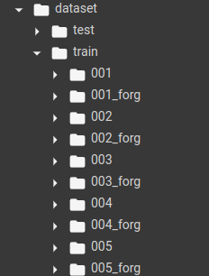
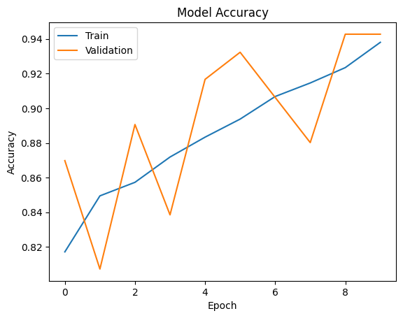

<h2 align="center">
  SignetDetect 
</h2>

## About

Signature detection tool to compare two signatures.

The training data is taken from [kaggle](https://www.kaggle.com/datasets/divyanshrai/handwritten-signatures).

## Usage

1. Clone this repository
1. install requirements with `pip install -r requirements.txt`
1. run the flask app using `python app.py`

## Training the model on a custom dataset

1. Open the model.ipynb file.
2. Either run with a dedicated GPU or click on the open in colab button.
3. Import the dataset and structure it as follows:

    

## Training statistics

The model was trined over a number of epochs by re-running the model fit() function.  
The latest 10 epochs are shown in the following figure as well as model.ipynb file.

Final Training Accuracy: 93.80%  
Final Validation Accuracy: 94.27%  
Training accuracy: 0.9380208253860474  
Validation accuracy: 0.9427083134651184
